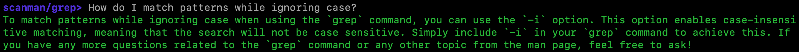

# scanman

`scanman` is a useful tool for interactively querying man pages using natural
language, employing an LLM in the backend to retrieve information.

Here's an example with the `grep` pattern matching tool:



## Installation

Set your `OPENAI_API_KEY`.

```bash
export OPENAI_API_KEY='<your-key-here>'
```

Clone the repository to your machine.

```bash
git clone https://github.com/nikhilkmr300/scanman.git
```

Create a virtual environment and activate it.

```bash
python3 -m venv .venv
source .venv/bin/activate
```

Install the `scanman` module.

```bash
pip install .
```

## Using `scanman`

Simply type `scanman <manpage>` in the terminal. For instance, `scanman grep`.
This opens a prompt where you can ask your questions.

To change the manpage, use the `:change` command.

```bash
:change echo
```

To exit, simply type `:exit` at the prompt.
